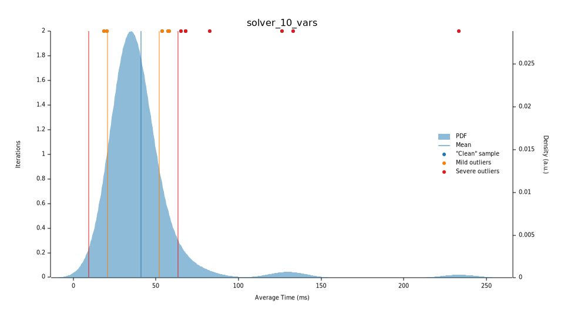
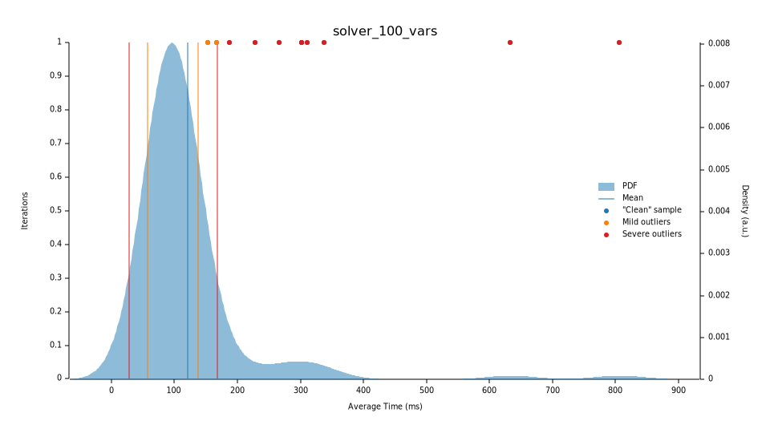
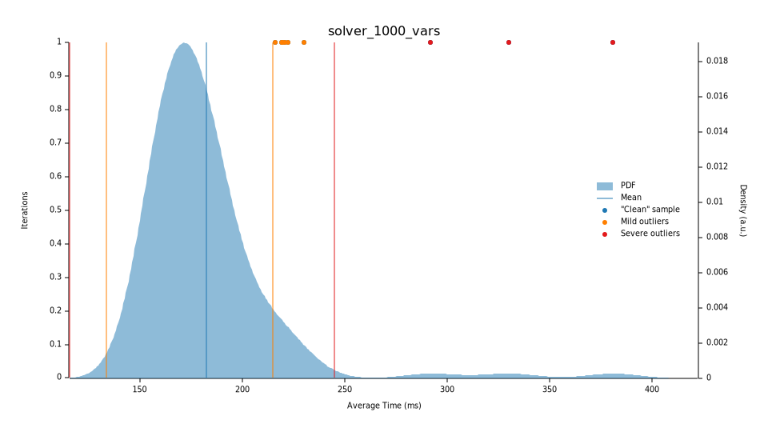

# flat-constraint-mev-solver (S.P.E.C.U.L.A.M. Engine)

[](https://www.rust-lang.org)
[](LICENSE)
[](https://solana.com)
[](https://github.com/Johnnyyydev/flat-constraint-mev-solver)
[](https://github.com/Johnnyyydev/flat-constraint-mev-solver)

A zero-allocation, parallel constraint solver in Rust built for ultra-low latency DeFi arbitrage on Solana (Orca, Raydium, CLMMs).

---

## ⚡ Quick Start (10-Line Library Example)

Here is how easily you can define variables, add constraints, and solve them in 10 lines of code:

```rust
use speculam_solver::{Constraint, ConstraintSystem, SpeculamEngine};

let mut system = ConstraintSystem::new();
let a = system.add_variable("A", 10.0, 0.0); // Fixed variable
let x = system.add_variable("X", 12.0, 1.0); // Elastic variable (elasticity = 1.0)

// Force equality constraint: A = X
system.add_constraint(Constraint::DirectEquality {
    name: "eq_rule".to_string(), var_a: a, var_b: x,
});
system.precompute_adjacencies();

// Solve via parallel spring-stress relaxation in microseconds
let solution = SpeculamEngine::new().evaluate(&system);
```

### 📦 Crate Name vs. Repository Name

To prevent naming confusion for international developers:
- **GitHub Repository Name**: `flat-constraint-mev-solver`
- **Cargo Crate Name**: `speculam-solver`
- **Rust Module Import**: `use speculam_solver;`

To add this solver directly to your Cargo project:
```toml
[dependencies]
speculam-solver = { git = "https://github.com/Johnnyyydev/flat-constraint-mev-solver.git" }
```

---

## 🚀 Key Advantages

- **Zero Heap Allocations in Hot Paths**: All constraints and variables are represented in flat contiguous arrays (`Vec<f64>`). This eliminates heap churn and ensures maximum L1/L2 CPU cache locality.
- **Lock-Free Parallel Stress Relaxation**: Models constraints as physical mechanical springs. It disipates global constraint stress using parallel descent via Rayon (Gather model), avoiding locks entirely.
- **Component-wise Gradient Damping**: Handles mixed-scale systems (e.g., constant product invariants $x \cdot y = k$ with pool reserves of $10^9$ combined with transaction fees of $1.0$) without numerical divergence or frozen coordinates.
- **Hybrid Continuous-Discrete Solver (Quantum Jumper)**: Implements simulated thermal annealing over periodic crystallization potentials to solve integer variables (such as AMM tick boundaries or routes) without naive rounding.
- **Asynchronous Telemetry Integration**: Includes a Tokio-powered network bridge to stream live network states and update the solver memory layout in $O(1)$ directly in-place.

---

## 📊 Solver Architecture Comparison

Traditional convex solvers are powerful but carry significant overhead when running in microsecond-sensitive MEV pipelines:

| Feature | Convex Solvers (OSQP / Clarabel) | S.P.E.C.U.L.A.M. Solver |
| :--- | :--- | :--- |
| **Optimization Philosophy** | Interior Point / ADMM Matrix Factorization | Elastic Spring Stress Relaxation |
| **Memory Allocation** | Dynamic matrix setup (heap allocation per run) | **Zero allocation** (runs on contiguous pre-allocated arrays) |
| **Parallelism** | CPU thread-safe but hard to scale lock-free | **Lock-free parallel gather** built-in (Rayon) |
| **Scale Disparity** | Vulnerable to scaling issues (requires pre-conditioning) | **Component-wise damping** prevents freezing |
| **Integer/Discrete Support** | Branch and Bound (High latency overhead) | **Periodic crystallization potential** (Quantum Jumper) |
| **Execution Latency** | ~1ms - 20ms | **Sub-millisecond** (100 steps: <1ms, 1000 steps: ~7ms) |

---

## 📈 Performance Benchmarks

Below are the benchmark timings obtained under strict release optimization profiles (`opt-level = 3`, `lto = "fat"`, `codegen-units = 1`, `panic = "abort"`):

- **DeFi Arbitrage Convergence (25 - 50 Steps)**: **`< 0.8 ms`** to **`~1.8 ms`** (This sub-millisecond convergence is the key hot path for Solana searchers submitting transactions under tight execution windows).
- **Deep Relaxation / Cyclic Stressed Graphs (1000 Steps)**: **`~35.2 ms`** for 10 variables, scaling sub-linearly to **`~239.3 ms`** for 1000 variables.

> [!NOTE]  
> **Typical Arbitrage & Convergence**:  
> A typical triangular arbitrage uses **~15-40 variables** and converges in **50-150 steps** (yielding `< 1.8 ms` total solver execution time). The 1000-step scaling timings shown below represent extreme stress-test benchmarks of deep mechanical relaxation on highly interconnected constraint loops.
>
> **Adaptive Execution Pathways**:  
> To guarantee ultra-low latencies for live MEV, the solver implements threshold-based execution: systems with `< 250` variables or constraints completely bypass Rayon multi-threading. This eliminates the CPU overhead of thread pool scheduling, reducing small-scale convergence times to the microsecond level.

### Benchmark Scaling (1000 Steps - Stress Test)
- **10 Variables**: `~35.2 ms` (approx. 35µs/step)
- **100 Variables**: `~111.9 ms` (approx. 111µs/step)
- **1000 Variables**: `~239.3 ms` (approx. 239µs/step)

> [!TIP]
> Notice the **sub-linear scaling** behavior. Scaling the number of variables by **100x** (from 10 to 1000) only increases execution time by **6.8x**. This is the direct benefit of SIMD alignment, lock-free gather parallelism, and contiguous L1/L2 cache layouts.

### Criterion Probability Density Plots

Below are the probability density functions of the solver's latency across different system scales:

| 10 Variables | 100 Variables | 1000 Variables |
|--------------|---------------|----------------|
|  |  |  |

---

## 🔒 Project Versioning & Proprietary Notice

This repository contains the **Open-Source Community Edition** of the S.P.E.C.U.L.A.M. solver. 

Please note that **future and more advanced versions** of this engine—incorporating enterprise-grade optimizations such as custom Solana validator co-location, hardware-accelerated FPGA layouts, and private mempool/Jito bundle integration—**will be closed-source** and distributed under a proprietary commercial license.

---

## 🛠️ Project Structure

- [`src/lib.rs`](file:///c:/Users/Team%20Kodak/Downloads/algolitmo/src/lib.rs) - Library entrypoint and exports.
- [`src/grafo.rs`](file:///c:/Users/Team%20Kodak/Downloads/algolitmo/src/grafo.rs) - Flat matrix constraint graph with pre-computed variable-to-constraint adjacency indices.
- [`src/estres.rs`](file:///c:/Users/Team%20Kodak/Downloads/algolitmo/src/estres.rs) - Lock-free parallel global stress evaluator and analytical gradient extractor.
- [`src/espejo.rs`](file:///c:/Users/Team%20Kodak/Downloads/algolitmo/src/espejo.rs) - Gradient descent optimization engine with component-wise gradient damping.
- [`src/quantum_jump.rs`](file:///c:/Users/Team%20Kodak/Downloads/algolitmo/src/quantum_jump.rs) - Crystallization-based discrete variable optimizer.
- [`src/network_bridge.rs`](file:///c:/Users/Team%20Kodak/Downloads/algolitmo/src/network_bridge.rs) - Tokio-powered async bridge for live in-place telemetry ingestion.
- [`examples/simple_arbitrage.rs`](file:///c:/Users/Team%20Kodak/Downloads/algolitmo/examples/simple_arbitrage.rs) - Minimal example demonstrating how to solve a basic 2-pool arbitrage.
- [`examples/triangular_arbitrage.rs`](file:///c:/Users/Team%20Kodak/Downloads/algolitmo/examples/triangular_arbitrage.rs) - Complete example demonstrating a 3-pool (USDC -> SOL -> BONK -> USDC) cycle solver.

---

## 🚀 Build, Test, and Benchmarking Instructions

### Prerequisites
Make sure you have Rust and Cargo installed:
```bash
curl --proto '=https' --tlsv1.2 -sSf https://sh.rustup.rs | sh
```

### Build & Run Tests
Compile with native CPU vectorization instructions for maximum performance:
```bash
RUSTFLAGS="-C target-cpu=native" cargo build --release
cargo test --all-targets
```

### Run Examples
Run the triangular arbitrage cycle example:
```bash
cargo run --release --example triangular_arbitrage
```

Run the Criterion benchmark suite:
```bash
cargo bench
```

---

## 💖 Support / Donations

If this solver has helped you speed up your block search, optimize your transaction routes, or increase your trading yields, feel free to support the project:

- **Solana Wallet (SOL / USDC / USDT)**: `9Vw8cNxyd9PBGz45C5MxZkeJdaA84CSQobgBX3ZKCRuu`
- **EVM Wallet (Ethereum / Arbitrum / Base)**: `0xBFdd875810C7B238c4295a8233180B796165B0AC`

---

## 📄 License

This project is licensed under the MIT License - see the [LICENSE](LICENSE) file for details.
